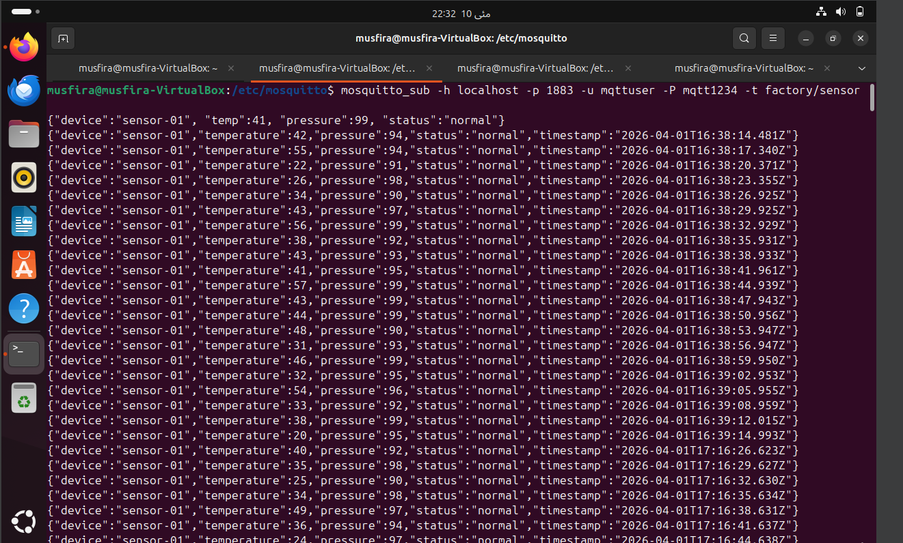
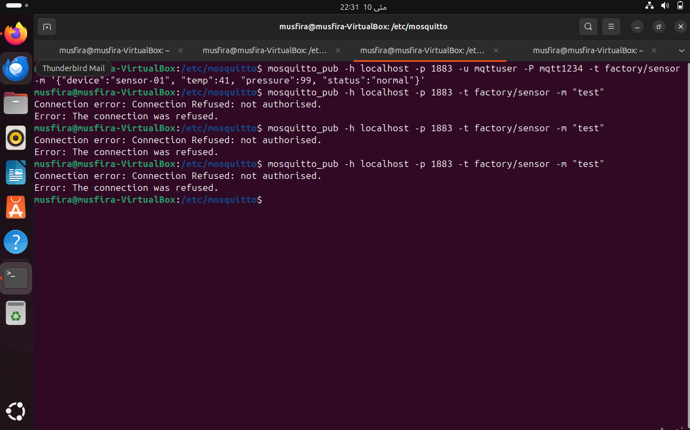
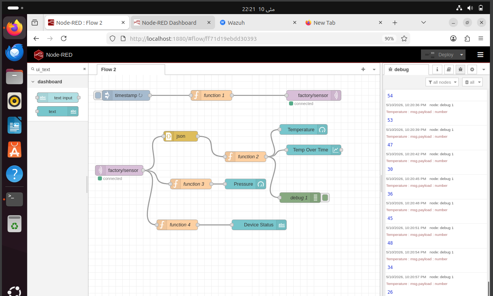
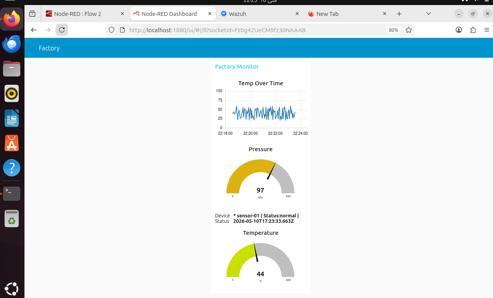
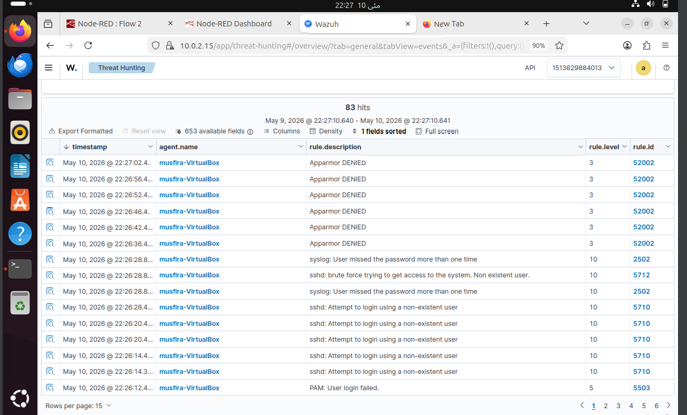
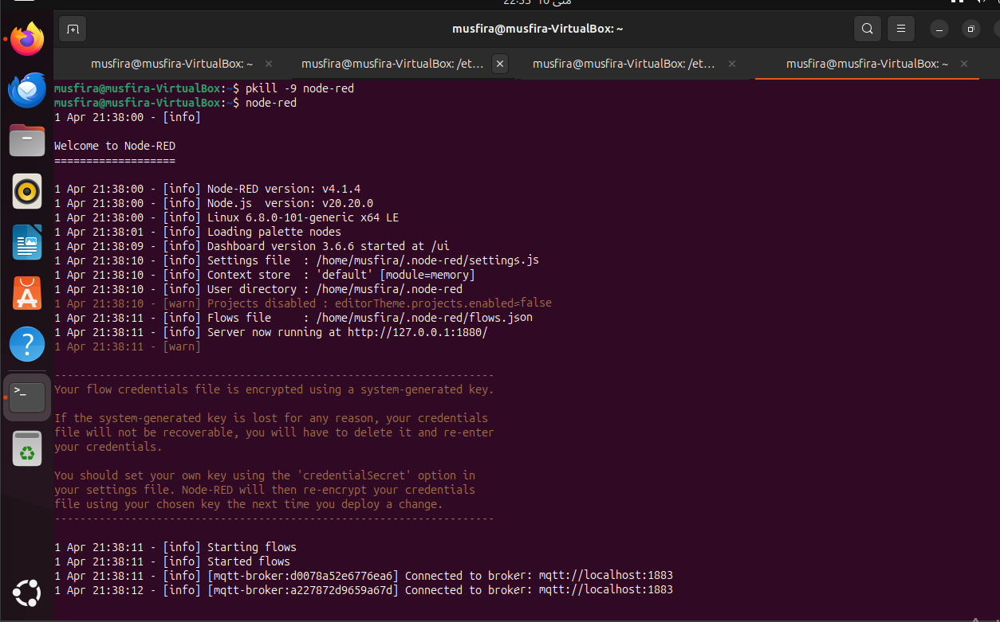

# Industry-4.0-Security
Description: Securing IoT-Enabled Smart Factories using Mosquitto MQTT, Node-RED and Wazuh SIEM — RQF Level 03
# 🏭 Industry 4.0 Security Demo


## 📌 Project Overview

This project demonstrates a **complete Industry 4.0 cybersecurity implementation** using open-source tools on Ubuntu Linux. It covers secure IoT communication, real-time industrial monitoring and live threat detection — all mapped to **IEC 62443** and **NIST CSF** international frameworks.

> *"A smart factory is only as secure as its weakest connected device — we built the tools to protect it."*

---

## 🎯 What This Project Demonstrates

| Requirement | Implementation | Tool Used |
|---|---|---|
| Secure IoT Communication | MQTT with authentication | Mosquitto |
| Data Encryption | TLS certificates on Port 8883 | OpenSSL + Mosquitto |
| Real-Time Monitoring | Live industrial dashboard | Node-RED |
| Threat Detection | Brute force attack detected | Wazuh SIEM |
| NIST CSF Protect | MQTT authentication | Mosquitto |
| NIST CSF Detect | Live dashboard monitoring | Node-RED |
| NIST CSF Respond | Rule 5712 Level 10 alert | Wazuh |
| IEC 62443 | Zone access control | Full stack |

---

## 🏗️ System Architecture

[IoT Sensors] → [MQTT Broker] → [Node-RED] → [Dashboard]
↓                              ↓
[Auth Check]                   [Wazuh SIEM]
↓                              ↓
[Access Denied]              [Security Alerts]


---

## 🛠️ Tools Used

### 1. Mosquitto MQTT Broker
- Publish-subscribe IoT protocol
- Username/password authentication enforced
- TLS encryption configured on Port 8883
- Anonymous connections completely blocked

### 2. Node-RED
- Visual flow-based programming tool
- Connects IoT sensors to live dashboard
- Displays temperature, pressure and device status
- Updates every 3 seconds automatically

### 3. Wazuh SIEM
- Real-time security monitoring platform
- Detected brute force attack — Rule 5712
- Severity Level 10 critical alert generated
- 1,134 security events monitored

---

## 📁 Repository Structure
Industry-4.0-Security-Demo/
│
├── README.md
├── mqtt/
│   ├── mqtt_setup.md
│   └── sensor_simulator.py
├── nodered/
│   ├── nodered_setup.md
│   └── flow.json
├── wazuh/
│   └── wazuh_setup.md
├── screenshots/
│   ├── mqtt_demo.png
│   ├── dashboard.png
│   └── wazuh_alerts.png
└── docs/
└── presentation.pdf


---

## ⚡ Quick Start

### Prerequisites
- Ubuntu 20.04 or later
- Python 3.x
- Docker and Docker Compose
- Node.js 18.x

### 1. Clone Repository
```bash
git clone https://github.com/YOUR_USERNAME/Industry-4.0-Security-Demo.git
cd Industry-4.0-Security-Demo
```

### 2. Install and Configure MQTT
```bash
sudo apt install mosquitto mosquitto-clients
sudo mosquitto_passwd -c /etc/mosquitto/passwd mqttuser
sudo systemctl restart mosquitto
```

### 3. Install Node-RED
```bash
sudo npm install -g --unsafe-perm node-red
node-red
```
Open: http://localhost:1880

### 4. Start Wazuh
```bash
cd wazuh-docker/single-node
docker compose up -d
```
Open: https://localhost

---

## 🔐 Security Implementation

### Authentication Layer
```bash
# Test authenticated connection
mosquitto_sub -h localhost -p 1883 \
-u mqttuser -P mqtt1234 \
-t factory/sensor

# Test anonymous blocked
mosquitto_pub -h localhost -p 1883 \
-t factory/sensor -m "test"
# Result: Connection Refused
```

### TLS Encryption Layer
```bash
# Generate certificates
sudo openssl genrsa -out ca.key 2048
sudo openssl req -new -x509 -days 365 \
-key ca.key -out ca.crt -subj "/CN=localhost"
```

### Threat Detection
```bash
# Simulate brute force attack
ssh wronguser@localhost
# Wazuh detects: Rule 5712 — Level 10
```

---

## 📊 Live Demo Results

| Test | Result |
|---|---|
| MQTT Authentication | ✅ Only mqttuser authorized |
| Anonymous Connection | ❌ Blocked — Connection refused |
| TLS Configuration | ✅ Certificates generated on Port 8883 |
| Dashboard | ✅ Live temperature and pressure monitoring |
| Brute Force Detection | ✅ Rule 5712 triggered — Level 10 |
| Total Events Monitored | 1,134 security events |

## 📸 Screenshots

### MQTT Data Flow — Live Sensor Data


### Authentication Proof — Anonymous Blocked


### Node-RED Flow Canvas


### Factory Monitor Dashboard


### Wazuh Threat Detection — Rule 5712 Level 10


### Node-RED Starting — Connected to Broker


---

## 🌐 Framework Mapping

### NIST Cybersecurity Framework
| Function | Implementation |
|---|---|
| Identify | IoT device inventory mapped |
| **Protect** | MQTT authentication + TLS |
| **Detect** | Node-RED dashboard + Wazuh |
| **Respond** | Wazuh Rule 5712 alert |
| Recover | System isolation procedures |

### IEC 62443
| Requirement | Implementation |
|---|---|
| Zone Access Control | MQTT authentication |
| Conduit Security | TLS encryption |
| Continuous Monitoring | Wazuh SIEM |
| Defence in Depth | 3-layer security stack |

---

## 📚 References

- NIST Cybersecurity Framework v1.1 (2018)
- IEC 62443 Industrial Security Standard (2018)
- ENISA Threat Landscape for ICS (2022)
- Eclipse Mosquitto Documentation
- Node-RED Documentation
- Wazuh Documentation

---

## 👩‍💻 Author

**Musfira**
RQF Level 03 — Industry 4.0 Security
